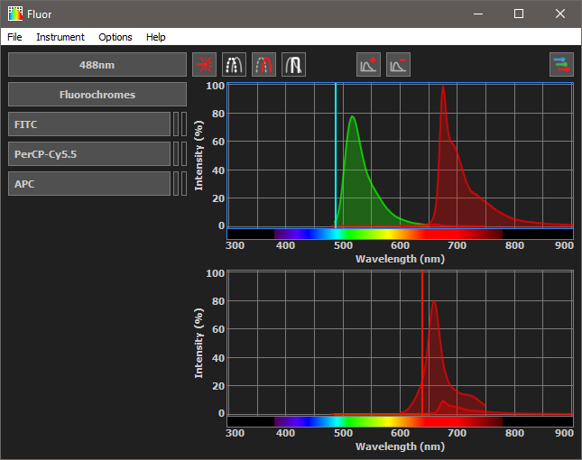

# Fluor

Fluor is a spectral viewer for the designing of high parameter multi-laser flow cytometry panels.

It provides an interface to visualize multiple parallel/co-linear laserlines and adjusts the emission intensity accordingly:

## Tutorial

Coming soon

## Build instructions

### Windows

The software is compiled using Mingw-w64 7.3.0 and Qt 5.12.3  
To compile run the following commands from project root:

- cmake -S . -B build -G "MinGW Makefiles" -DCMAKE_BUILD_TYPE=Release
- mingw32-make -C build

Afterwards add these dll's to the build directory:

- libgcc_s_seh-1.dll, libstdc++-6.dll, libwinpthread-1.dll
- Qt5Core.dll, Qt5Gui.dll, Qt5Widgets.dll, platforms/qwindows.dll

Finally, the program icons can be embedded in the executable using rcedit.

- . .\\.tools\rcedit-x64 ".\\.releases\Fluor v0.10.1\fluor.exe" --set-icon ".\resources\icons\fluor_light.ico"

### MacOS and Linux

Fluor contains platforms specific code and should work equally well on MacOS and Linux.  
I haven't tested this though. When you find any bugs/unexpected behavior, please let me know.  
Instructions will follow eventually.

## Version List

v0.10.1 - Dark & light styles, graph y-axis rescaling  
v0.10.0 - First beta version  
v0.9.13 - Implemented the menu bar and saving of user-settings  
v0.9.12 - Fluorophore data is now stored and parsed in json format  
v0.9.11 - Instrument data is now stored and parsed in json format  
v0.9.10 - Updated laser popup and global event handling  
v0.9.9 - Separated the graph/cache/button states from the GUI representation  
v0.9.8 - Fixed some DPI scaling issues, improved bounding box calculations for spectrum  
v0.9.7 - Intensity scaling of spectra, multiple graphs, laser/filter visibility  
v0.9.6 - Implementation of instrument loading, plotting of lasers and filters  
v0.9.5 - Multi-window DPI support, graph styling  
v0.9.4 - Implementation of graph plots, and graph synchronisation  
v0.9.3 - Implementation of graph base, item menu widgets, and item caches  
v0.9.2 - Updated Qt LGPL license, updated lineedit popup, and event handling  
v0.9.1 - Widgets for cytometer menu, fluorophore menu, and toolbar  
v0.9.0 - Parsers and UNIT tests for styles and fluorophores  

-------- Python version ----------  
v0.8.5 - Light/Dark stylesheets, style changing, window states, and license window  
v0.8.4 - QSetting saving and style QSetting implemented  
v0.8.3 - QSetting parsers, implemented fallback for data loading failure  
v0.8.2 - Stylesheet updated, updated mouse event handling LineEdit widgets  
v0.8.1 - QApplication stylesheets, minor layout fixes  
v0.8.0 - Laser, Menu, Graph updated, Popup/GraphLayout resizing updated  
v0.7.5 - MenuLayout sorting implemented  
v0.7.4 - MenuLayout now fully implemented QScrollArea  
v0.7.3 - QCompleter rewritten and updated  
v0.7.2 - Cytometer settings now switchable  
v0.7.1 - Settings.ini implemented  
v0.6.1 - graphPlot add-/removeable and fully scrollable  
v0.6.0 - started implementing graphPlot scrollWidget  
v0.5.5 - fluorophore menu completer fully functional  
v0.5.4 - started implementing fluorophore menu completer  
v0.5.1 - fluorophore menu extended, laser menu added, Data.ini implemented  
v0.4 - functional graphPlot and fluorophore menu

## Authors

AJ Zwijnenburg

## Frameworks

Fluor makes use of the following frameworks under the specified license:  
Qt - [LGPLv3](https://choosealicense.com/licenses/lgpl-3.0/)

## License

Fluor is licensed under [LGPLv3](https://choosealicense.com/licenses/lgpl-3.0/)
