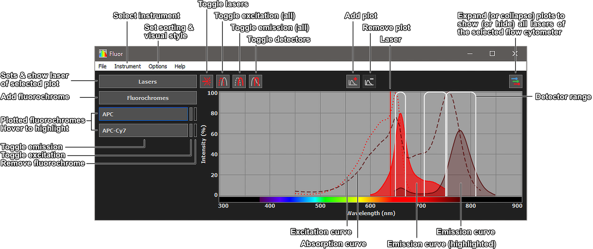

# Fluor

Fluor is a high-performance spectral viewer for the designing of high parameter multi-laser flow cytometry panels. Fluor separates individual (parallel) laserlines into individual graphs providing a clear overview of the fluorochrome emission spillover and excitation efficiency. Fluor is easily customisable; the user can manually add in user-readable format flow cytometer specifications (see instruments.json), fluorochromes (fluorophores.json), and even style/colorscheme (styles.ini). Efficiency is improved with a complete fluorophore database that can be easily searched with auto-completion and allows for synonyms. No more confusion: is it FITC or fluorescein. Both work in Fluor!

Currently released for Windows (see a full build in [releases](releases)).

## Tutorial

Welcome to Fluor! It extends the basic viewer functions with multiple graphs and easy lookup.

Below an overview of the user interface:

The most convenient way to start is to first select a specific instrument. With a single click on the top-right 'expand laserlines' button, all parallel/co-linear laserlines of the selected instrument are plotted with their respective detector ranges. One can also manually setup the plot by setting 'Instrument' -> 'None', and manually adding or removing graphs and setting the laser wavelength.

Use the fluorophore button to find the fluorochromes you want to depict on the graphs. One can type out the fluorophore names and the Fluor will show a list of options and autocompletes the written text. You can easily select your fluorochrome of interest by using the arrow keys or double-click. Typing a comma will enable you to select further fluorochromes without having to close the selection menu. Previously selected fluorochromes will be grayed-out. Press 'enter' or click outside the menu to plot the selected fluorochromes.

The selected fluorochromes will be shown in a list on the left and plotted in the graph or graphs. The emissions curves are corrected for excitation efficiency both in parallel and colinear laserline setups. Hovering over the fluorochrome names highlights the specific fluorochrome emission curves in the graphs. Similarly selecting a curve in a graph by clicking and hovering over a curve, highlights the fluorochrome name in the list. Note: use scrollwheel to cycle between overlapping curves.

## Build instructions

### Windows

The software is compiled using Mingw-w64 7.3.0 and Qt 5.12.3  
To compile run the following commands from project root:

- cmake -S . -B build -G "MinGW Makefiles" -DCMAKE_BUILD_TYPE=Release
- mingw32-make -C build

Afterwards add these dll's to the build directory:

- libgcc_s_seh-1.dll, libstdc++-6.dll, libwinpthread-1.dll
- Qt5Core.dll, Qt5Gui.dll, Qt5Widgets.dll, platforms/qwindows.dll

Finally, the program icons can be embedded in the executable using rcedit.

- . .\\.tools\rcedit-x64 ".\\.releases\Fluor v0.10.1\fluor.exe" --set-icon ".\resources\icons\fluor_light.ico"

### MacOS and Linux

Fluor contains platforms specific code and should work equally well on MacOS and Linux. You have to build it yourself and I haven't tested this. When you find any bugs/unexpected behavior, please let me know. If people request it, I will happely make work of this.

## Version List

v0.10.2 - Bugfixes & reformatted code & improved tutorial  
v0.10.1 - Dark & light styles, graph y-axis rescaling  
v0.10.0 - First beta version  
v0.9.13 - Implemented the menu bar and saving of user-settings  
v0.9.12 - Fluorophore data is now stored and parsed in json format  
v0.9.11 - Instrument data is now stored and parsed in json format  
v0.9.10 - Updated laser popup and global event handling  
v0.9.9 - Separated the graph/cache/button states from the GUI representation  
v0.9.8 - Fixed some DPI scaling issues, improved bounding box calculations for spectrum  
v0.9.7 - Intensity scaling of spectra, multiple graphs, laser/filter visibility  
v0.9.6 - Implementation of instrument loading, plotting of lasers and filters  
v0.9.5 - Multi-window DPI support, graph styling  
v0.9.4 - Implementation of graph plots, and graph synchronisation  
v0.9.3 - Implementation of graph base, item menu widgets, and item caches  
v0.9.2 - Updated Qt LGPL license, updated lineedit popup, and event handling  
v0.9.1 - Widgets for cytometer menu, fluorophore menu, and toolbar  
v0.9.0 - Parsers and UNIT tests for styles and fluorophores  

-------- Python version ----------  
v0.8.5 - Light/Dark stylesheets, style changing, window states, and license window  
v0.8.4 - QSetting saving and style QSetting implemented  
v0.8.3 - QSetting parsers, implemented fallback for data loading failure  
v0.8.2 - Stylesheet updated, updated mouse event handling LineEdit widgets  
v0.8.1 - QApplication stylesheets, minor layout fixes  
v0.8.0 - Laser, Menu, Graph updated, Popup/GraphLayout resizing updated  
v0.7.5 - MenuLayout sorting implemented  
v0.7.4 - MenuLayout now fully implemented QScrollArea  
v0.7.3 - QCompleter rewritten and updated  
v0.7.2 - Cytometer settings now switchable  
v0.7.1 - Settings.ini implemented  
v0.6.1 - graphPlot add-/removeable and fully scrollable  
v0.6.0 - started implementing graphPlot scrollWidget  
v0.5.5 - fluorophore menu completer fully functional  
v0.5.4 - started implementing fluorophore menu completer  
v0.5.1 - fluorophore menu extended, laser menu added, Data.ini implemented  
v0.4 - functional graphPlot and fluorophore menu

## Authors

AJ Zwijnenburg

## Frameworks

Fluor makes use of the following frameworks under the specified license:  
Qt - [LGPLv3](https://choosealicense.com/licenses/lgpl-3.0/)

## License

Fluor is licensed under [LGPLv3](https://choosealicense.com/licenses/lgpl-3.0/)
